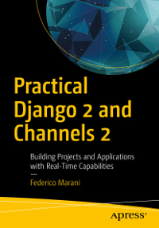

# Practical Django 2 and Channels 2: 
Building Projects and Applications with Real-Time Capabilities

1) Adding the Product Catalog to the Site
2) A Checkout System for Receiving Orders Online
3) Adding CSS/JavaScript
4) Using External Libraries
5) Making an Internal Dashboard for the Company
6) Backend for a Mobile Customer-Service App
7) Mobile Customer-Service App
8) Deploy Sites

Link:

